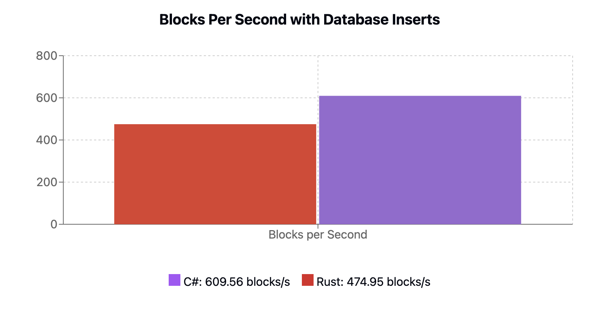
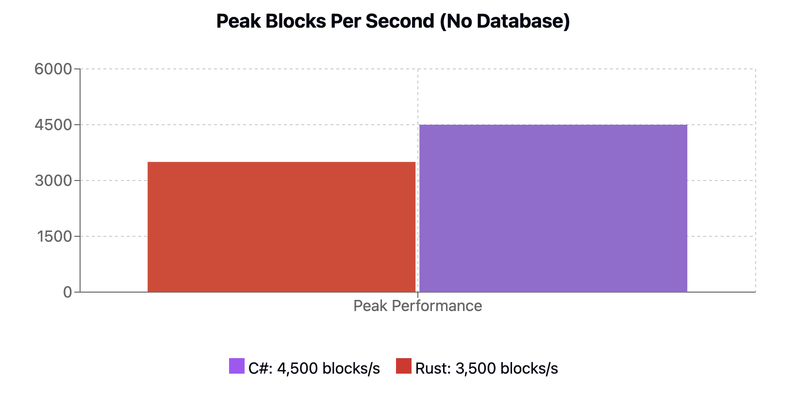

<div align="center">
  <h1>Chrysalis 🦋</h1>
  <p>A comprehensive .NET ecosystem for Cardano blockchain development</p>
  
  <a href="https://www.nuget.org/packages/Chrysalis">
    
  </a>
  <a href="https://github.com/SAIB-Inc/Chrysalis/blob/main/LICENSE.md">
    
  </a>
  <a href="https://github.com/SAIB-Inc/Chrysalis/fork">
    
  </a>
  <a href="https://github.com/SAIB-Inc/Chrysalis/stargazers">
    
  </a>
  <a href="https://github.com/SAIB-Inc/Chrysalis/graphs/contributors">
    
  </a>
  <br>
  <a href="https://dotnet.microsoft.com/download">
    
  </a>
  <a href="https://cardano.org/">
    
  </a>
</div>

## 📖 Overview

Chrysalis is a native .NET toolkit for Cardano blockchain development, providing everything needed to build applications on Cardano. From CBOR serialization to transaction building and smart contract interaction, Chrysalis offers a complete solution for .NET developers.

**Key Components:**
- 📦 **Serialization** - Efficient CBOR encoding/decoding for Cardano data structures
- 🔄 **Node Communication** - Direct interaction with Cardano nodes
- 🔑 **Wallet Management** - Address generation and key handling
- 💳 **Transaction Building** - Simple and advanced transaction construction
- 📜 **Smart Contract Integration** - Plutus script evaluation and validation

## ✨ Features

- 🔐 **Type-Safe Data Models** - Strong typing for all Cardano blockchain structures
- ⚡ **High Performance** - Optimized for speed and efficiency
- 🧩 **Modular Architecture** - Use only what you need
- 🚀 **Modern C# API** - Takes advantage of the latest .NET features
- 🔗 **Complete Cardano Support** - Works with all major Cardano eras and protocols

## 📥 Installation

```bash
# Install the main package
dotnet add package Chrysalis
```

Or install individual components:

```bash
dotnet add package Chrysalis.Cbor
dotnet add package Chrysalis.Network
dotnet add package Chrysalis.Tx
dotnet add package Chrysalis.Plutus
dotnet add package Chrysalis.Wallet
```

## 🧩 Architecture

Chrysalis consists of several specialized libraries:

| Module | Description |
|--------|-------------|
| **Chrysalis.Cbor** | CBOR serialization for Cardano data structures |
| **Chrysalis.Network** | Implementation of Ouroboros mini-protocols |
| **Chrysalis.Tx** | Transaction building and submission |
| **Chrysalis.Plutus** | Smart contract evaluation and validation |
| **Chrysalis.Wallet** | Key management and address handling |

## 💻 Usage Examples

### 📦 CBOR Serialization

Define and use CBOR-serializable types with attribute-based serialization:

```csharp
// Define CBOR-serializable types
[CborSerializable]
[CborConstr(0)]
public partial record AssetDetails(
    [CborOrder(0)] byte[] PolicyId,
    [CborOrder(1)] AssetClass Asset,
    [CborOrder(2)] ulong Amount 
): CborBase;

[CborSerializable]
[CborList]
public partial record AssetClass(
    [CborOrder(0)] byte[] PolicyId,
    [CborOrder(1)] byte[] AssetName
) : CborBase;

// Deserialize from CBOR hex
var data = "d8799f581cc05cb5c5f43aac9d9e057286e094f60d09ae61e8962ad5c42196180c9f4040ff1a00989680ff";
AssetDetails details = CborSerializer.Deserialize<AssetDetails>(data);

// Serialize back to CBOR
byte[] serialized = CborSerializer.Serialize(details);
```

### 🔑 Wallet Management

Generate and manage addresses and keys:

```csharp
// Create wallet from mnemonic
string mnemonic = "your mnemonic here";
var wallet = Mnemonic.Restore(mnemonic, English.Words);

// Derive keys following Cardano standards
var accountKey = wallet.GetRootKey()
    .Derive(PurposeType.Shelley, DerivationType.HARD)
    .Derive(CoinType.Ada, DerivationType.HARD)
    .Derive(0, DerivationType.HARD);

var paymentKey = accountKey
    .Derive(RoleType.ExternalChain)
    .Derive(0);
var stakingKey = accountKey
    .Derive(RoleType.Staking)
    .Derive(0);

// Generate address
var address = new Address(
    NetworkType.Testnet, 
    AddressType.BasePayment,
    paymentKey.GetPublicKey(), 
    stakingKey.GetPublicKey()
);

string bech32Address = address.ToBech32();
```

### 🔄 Node Communication

Connect directly to a Cardano node:

```csharp
// Connect to a local node
NodeClient client = await NodeClient.ConnectAsync("/ipc/node.socket");
await client.StartAsync(networkMagic: 2);

// Query UTXOs by address
byte[] addressBytes = Convert.FromHexString("00a7e1d2e57b1f9aa851b08c8934a315ffd97397fa997bb3851c626d3bb8d804d91fa134757d1a41b0b12762f8922fe4b4c6faa5ffec1bc9cf");
var utxos = await client.LocalStateQuery.GetUtxosByAddressAsync([addressBytes]);

// Synchronize with the chain
var chainSync = client.GetProtocol<ChainSync>();
var tip = await chainSync.GetTipAsync();
```

### 💳 Transaction Building

Build and sign transactions with the fluent API or template builder:

```csharp
// Simple transaction using template builder
var provider = new Blockfrost("apiKeyHere");
var transfer = TransactionTemplateBuilder<ulong>.Create(provider)
    .AddStaticParty("sender", senderAddress, true)
    .AddStaticParty("receiver", receiverAddress)
    .AddInput((options, amount) => {
        options.From = "sender";
    })
    .AddOutput((options, amount) => {
        options.To = "receiver";
        options.Amount = new Lovelace(amount);
    })
    .Build();

// Execute the template with a specific amount
Transaction tx = await transfer(5_000_000UL);
Transaction signedTx = tx.Sign(privateKey);
```

### 📜 Smart Contract Interaction

Interact with and validate Plutus scripts:

```csharp
// Create a validator transaction
var unlockLovelace = TransactionTemplateBuilder<UnlockParameters>.Create(provider)
    .AddStaticParty("owner", ownerAddress, true)
    .AddStaticParty("validator", validatorAddress)
    .AddInput((options, unlockParams) => {
        options.From = "validator";
        options.UtxoRef = new TransactionInput(unlockParams.ScriptRef.Id, unlockParams.ScriptRef.Index);
        options.IsReference = true;
    })
    .AddInput((options, unlockParams) => {
        options.From = "validator";
        options.UtxoRef = new TransactionInput(unlockParams.LockedUtxo.Id, unlockParams.LockedUtxo.Index);
        options.Redeemer = unlockParams.Redeemer;
    })
    .AddOutput((options, unlockParams) => {
        options.To = "owner";
        options.Amount = unlockParams.Amount;
    })
    .Build();

// Evaluate script execution
var evaluator = new Evaluator();
var result = evaluator.EvaluateTx(transaction, datums, redeemers);
```

## ⚡ Performance

Chrysalis is optimized for performance, outperforming equivalent libraries in other languages. Our benchmarks show superior performance in key operations:

<div align="center">
  <p><strong>Performance with Database Operations</strong></p>
  
</div>

<div align="center">
  <p><strong>Performance without Database Operations</strong></p>
  
</div>

Key performance advantages:
- Faster block deserialization
- Optimized chain synchronization
- Efficient memory management
- Excellent scalability for high-throughput applications

## 🔄 Cardano Era Support

Chrysalis provides comprehensive support for Cardano's evolution:

<table>
<thead>
  <tr>
    <th>Era</th>
    <th>Phase</th>
    <th>Status</th>
    <th colspan="3">Feature Support</th>
  </tr>
  <tr>
    <th></th>
    <th></th>
    <th></th>
    <th align="center">Serialization</th>
    <th align="center">Block Processing</th>
    <th align="center">Transaction Building</th>
  </tr>
</thead>
<tbody>
  <tr>
    <td><strong>Byron</strong></td>
    <td>Foundation</td>
    <td align="center">🚧</td>
    <td align="center">❌</td>
    <td align="center">❌</td>
    <td align="center">❌</td>
  </tr>
  <tr>
    <td><strong>Shelley</strong></td>
    <td>Decentralization</td>
    <td align="center">✅</td>
    <td align="center">✅</td>
    <td align="center">✅</td>
    <td align="center">✅</td>
  </tr>
  <tr>
    <td><strong>Allegra</strong></td>
    <td>Token Locking</td>
    <td align="center">✅</td>
    <td align="center">✅</td>
    <td align="center">✅</td>
    <td align="center">✅</td>
  </tr>
  <tr>
    <td><strong>Mary</strong></td>
    <td>Multi-Asset</td>
    <td align="center">✅</td>
    <td align="center">✅</td>
    <td align="center">✅</td>
    <td align="center">✅</td>
  </tr>
  <tr>
    <td><strong>Alonzo</strong></td>
    <td>Smart Contracts</td>
    <td align="center">✅</td>
    <td align="center">✅</td>
    <td align="center">✅</td>
    <td align="center">✅</td>
  </tr>
  <tr>
    <td><strong>Babbage/Vasil</strong></td>
    <td>Scaling</td>
    <td align="center">✅</td>
    <td align="center">✅</td>
    <td align="center">✅</td>
    <td align="center">✅</td>
  </tr>
  <tr>
    <td><strong>Conway</strong></td>
    <td>Governance</td>
    <td align="center">✅</td>
    <td align="center">✅</td>
    <td align="center">✅</td>
    <td align="center">✅</td>
  </tr>
</tbody>
</table>

**Legend**:
- ✅ Fully Supported
- 🚧 Planned for Future Release
- ❌ Not Supported Yet

## 📚 Documentation

For detailed documentation on each component:

- [Chrysalis.Cbor Documentation](./CBOR.md)
- [Chrysalis.Tx Documentation](./TX.md)

## 🤝 Contributing

We welcome contributions! To get started:

1. Fork the repository
2. Create a feature branch: `git checkout -b feature/amazing-feature`
3. Commit your changes: `git commit -m 'feat: add amazing feature'`
4. Push to the branch: `git push origin feature/amazing-feature`
5. Open a Pull Request

Please make sure to update tests as appropriate.

## 📄 License

This project is licensed under the MIT License - see the [LICENSE.md](LICENSE.md) file for details.

---

<div align="center">
  <p>Made with ❤️ by <a href="https://saib.dev">SAIB Inc</a> for the Cardano community</p>
</div>