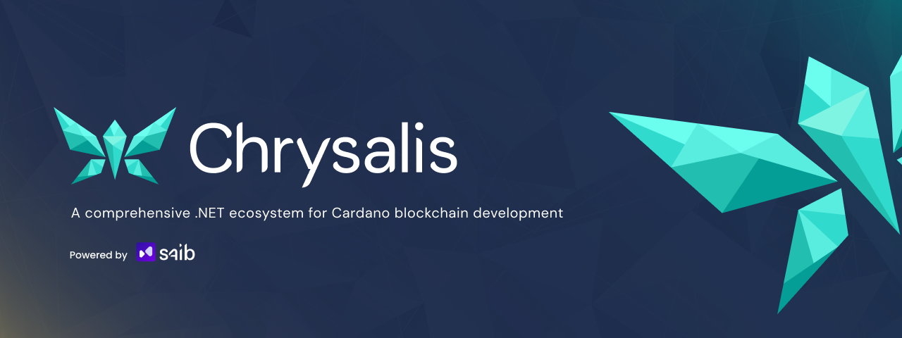

<div align="center">
  
  
  <p>A comprehensive .NET ecosystem for Cardano blockchain development</p>
  
  <a href="https://www.nuget.org/packages/Chrysalis">
    
  </a>
  <a href="https://github.com/SAIB-Inc/Chrysalis/blob/main/LICENSE.md">
    
  </a>
  <a href="https://github.com/SAIB-Inc/Chrysalis/fork">
    
  </a>
  <a href="https://github.com/SAIB-Inc/Chrysalis/stargazers">
    
  </a>
  <a href="https://github.com/SAIB-Inc/Chrysalis/graphs/contributors">
    
  </a>
  <br>
  <a href="https://dotnet.microsoft.com/download">
    
  </a>
  <a href="https://cardano.org/">
    
  </a>
</div>

## 📖 Overview

Chrysalis is a native .NET toolkit for Cardano blockchain development, providing everything needed to build applications on Cardano. From CBOR serialization to transaction building and smart contract interaction, Chrysalis offers a complete solution for .NET developers.

**Key Components:**
- 📦 **Serialization** - Efficient CBOR encoding/decoding for Cardano data structures
- 🔄 **Node Communication** - Direct interaction with Cardano nodes through Ouroboros mini-protocols
- 🔑 **Wallet Management** - Address generation and key handling
- 💳 **Transaction Building** - Simple and advanced transaction construction
- 📜 **Smart Contract Integration** - Plutus script evaluation and validation via Rust FFI

## ✨ Features

- 🔐 **Type-Safe Data Models** - Strong typing for all Cardano blockchain structures
- ⚡ **High Performance** - Optimized for speed and efficiency
- 🧩 **Modular Architecture** - Use only what you need
- 🚀 **Modern C# API** - Takes advantage of the latest .NET features
- 🔗 **Complete Cardano Support** - Works with all major Cardano eras and protocols

## 📥 Installation

```bash
# Install the main package
dotnet add package Chrysalis
```

Or install individual components:

```bash
dotnet add package Chrysalis.Cbor
dotnet add package Chrysalis.Network
dotnet add package Chrysalis.Tx
dotnet add package Chrysalis.Plutus
dotnet add package Chrysalis.Wallet
```

## 🧩 Architecture

Chrysalis consists of several specialized libraries:

| Module | Description |
|--------|-------------|
| **Chrysalis.Cbor** | CBOR serialization for Cardano data structures |
| **Chrysalis.Cbor.CodeGen** | Source generation for optimized serialization code |
| **Chrysalis.Network** | Implementation of Ouroboros mini-protocols |
| **Chrysalis.Tx** | Transaction building and submission |
| **Chrysalis.Plutus** | Smart contract evaluation and validation |
| **Chrysalis.Wallet** | Key management and address handling |

## 💻 Usage Examples

### 📦 CBOR Serialization

Define and use CBOR-serializable types with attribute-based serialization:

```csharp
// Define CBOR-serializable types
[CborSerializable]
[CborConstr(0)]
public partial record AssetDetails(
    [CborOrder(0)] byte[] PolicyId,
    [CborOrder(1)] AssetClass Asset,
    [CborOrder(2)] ulong Amount 
): CborBase;

[CborSerializable]
[CborList]
public partial record AssetClass(
    [CborOrder(0)] byte[] PolicyId,
    [CborOrder(1)] byte[] AssetName
) : CborBase;

// Deserialize from CBOR hex
var data = "d8799f581cc05cb5c5f43aac9d9e057286e094f60d09ae61e8962ad5c42196180c9f4040ff1a00989680ff";
AssetDetails details = CborSerializer.Deserialize<AssetDetails>(data);

// Serialize back to CBOR
byte[] serialized = CborSerializer.Serialize(details);
```

#### Extension Method Pattern

Chrysalis uses extension methods extensively to provide clean access to nested data structures:

```csharp
// Without extensions, deep property access is verbose and differs by era
var hash = transaction.TransactionBody.Inputs.GetValue()[0].TransactionId;

// With extension methods, access is simplified and era-agnostic
var hash = transaction.TransactionBody.Inputs().First().TransactionId();

// Extensions support common operations
Transaction signedTx = transaction.Sign(privateKey);
```

### 🔑 Wallet Management

Generate and manage addresses and keys:

```csharp
// Create wallet from mnemonic
string mnemonic = "your mnemonic here";
var wallet = Mnemonic.Restore(mnemonic, English.Words);

// Derive keys following Cardano standards
var accountKey = wallet.GetRootKey()
    .Derive(PurposeType.Shelley, DerivationType.HARD)
    .Derive(CoinType.Ada, DerivationType.HARD)
    .Derive(0, DerivationType.HARD);

var paymentKey = accountKey
    .Derive(RoleType.ExternalChain)
    .Derive(0);
var stakingKey = accountKey
    .Derive(RoleType.Staking)
    .Derive(0);

// Generate address
var address = new Address(
    NetworkType.Testnet, 
    AddressType.BasePayment,
    paymentKey.GetPublicKey(), 
    stakingKey.GetPublicKey()
);

string bech32Address = address.ToBech32();
```

### 🔄 Node Communication

Connect directly to a Cardano node:

```csharp
try {
    // Connect to a local node
    NodeClient client = await NodeClient.ConnectAsync("/ipc/node.socket");
    await client.StartAsync(networkMagic: 2UL);

    // Query UTXOs by address
    byte[] addressBytes = Convert.FromHexString("00a7e1d2e57b1f9aa851b08c8934a315ffd97397fa997bb3851c626d3bb8d804d91fa134757d1a41b0b12762f8922fe4b4c6faa5ffec1bc9cf");
    var utxos = await client.LocalStateQuery.GetUtxosByAddressAsync(new List<byte[]> { addressBytes });

    // Synchronize with the chain
    var tip = await client.ChainSync.GetTipAsync();
    
    // Available mini-protocols - accessed as properties
    var localTxSubmit = client.LocalTxSubmit;
    var localStateQuery = client.LocalStateQuery;
    var localTxMonitor = client.LocalTxMonitor;
}
catch (InvalidOperationException ex) {
    Console.WriteLine($"Connection failed: {ex.Message}");
}
catch (Exception ex) {
    Console.WriteLine($"Protocol error: {ex.Message}");
}
```

### 💳 Transaction Building

Build and sign transactions with the fluent API or template builder:

```csharp
// Simple transaction using template builder
var provider = new Blockfrost("apiKeyHere");
var transfer = TransactionTemplateBuilder<ulong>.Create(provider)
    .AddStaticParty("sender", senderAddress, true)
    .AddStaticParty("receiver", receiverAddress)
    .AddInput((options, amount) => {
        options.From = "sender";
    })
    .AddOutput((options, amount) => {
        options.To = "receiver";
        options.Amount = new Lovelace(amount);
    })
    .Build();

// Execute the template with a specific amount
Transaction tx = await transfer(5_000_000UL);
Transaction signedTx = tx.Sign(privateKey);
```

### 📜 Smart Contract Interaction

Interact with and validate Plutus scripts:

```csharp
try {
    // Create a validator transaction
    var unlockLovelace = TransactionTemplateBuilder<UnlockParameters>.Create(provider)
        .AddStaticParty("owner", ownerAddress, true)
        .AddStaticParty("validator", validatorAddress)
        .AddInput((options, unlockParams) => {
            options.From = "validator";
            options.UtxoRef = new TransactionInput(unlockParams.ScriptRef.Id, unlockParams.ScriptRef.Index);
            options.IsReference = true;
        })
        .AddInput((options, unlockParams) => {
            options.From = "validator";
            options.UtxoRef = new TransactionInput(unlockParams.LockedUtxo.Id, unlockParams.LockedUtxo.Index);
            options.Redeemer = unlockParams.Redeemer;
        })
        .AddOutput((options, unlockParams) => {
            options.To = "owner";
            options.Amount = unlockParams.Amount;
        })
        .Build();

    // Evaluate script execution via Rust FFI - Evaluator is a static class
    byte[] txCborBytes = CborSerializer.Serialize(transaction);
    byte[] utxoCborBytes = CborSerializer.Serialize(resolvedInputs);
    IReadOnlyList<EvaluationResult> results = Evaluator.EvaluateTx(txCborBytes, utxoCborBytes);
    
    // Update redeemers with actual execution units
    foreach (var result in results)
    {
        // Access execution unit data
        RedeemerTag tag = result.RedeemerTag;
        uint index = result.Index; // Index is uint, not int
        ExUnits units = result.ExUnits;
        
        Console.WriteLine($"Redeemer {tag}:{index} requires {units.Mem} memory units and {units.Steps} CPU steps");
    }
    
    // Then update transaction with actual execution costs
    builder.SetRedeemers(updatedRedeemers);
}
catch (InvalidOperationException ex) {
    Console.WriteLine($"Script evaluation failed: {ex.Message}");
}
```

#### CIP Implementation Support

Chrysalis supports various Cardano Improvement Proposals (CIPs), including:

```csharp
// CIP-68 NFT standard implementation
var nftMetadata = new Cip68<PlutusData>(
    Metadata: metadata,
    Version: 1,
    Extra: null
);
```

## ⚡ Performance

Chrysalis is optimized for performance, with benchmarks showing it outperforms equivalent libraries in other languages, including Pallas (Rust). Our benchmarks show superior performance in key operations:

<div align="center">
  <p><strong>Performance with Database Operations</strong></p>
  <p>Chrysalis (609.56 blocks/s) vs Pallas Rust (474.95 blocks/s)</p>
  
</div>

<div align="center">
  <p><strong>Performance without Database Operations</strong></p>
  <p>Chrysalis (4,500 blocks/s) vs Pallas Rust (3,500 blocks/s)</p>
  
</div>

Key performance advantages:
- Faster block deserialization (approximately 28% faster than Rust)
- Optimized chain synchronization
- Lower memory footprint (reduced allocations)
- Excellent scalability for high-throughput applications

These benchmarks were performed using BenchmarkDotNet with proper warm-up cycles, multiple iterations, and statistical analysis.

## 🔄 Cardano Era Support

Chrysalis provides comprehensive support for Cardano's evolution:

<table>
<thead>
  <tr>
    <th>Era</th>
    <th>Phase</th>
    <th>Status</th>
    <th colspan="3">Feature Support</th>
  </tr>
  <tr>
    <th></th>
    <th></th>
    <th></th>
    <th align="center">Serialization</th>
    <th align="center">Block Processing</th>
    <th align="center">Transaction Building</th>
  </tr>
</thead>
<tbody>
  <tr>
    <td><strong>Byron</strong></td>
    <td>Foundation</td>
    <td align="center">🚧</td>
    <td align="center">❌</td>
    <td align="center">❌</td>
    <td align="center">❌</td>
  </tr>
  <tr>
    <td><strong>Shelley</strong></td>
    <td>Decentralization</td>
    <td align="center">✅</td>
    <td align="center">✅</td>
    <td align="center">✅</td>
    <td align="center">✅</td>
  </tr>
  <tr>
    <td><strong>Allegra</strong></td>
    <td>Token Locking</td>
    <td align="center">✅</td>
    <td align="center">✅</td>
    <td align="center">✅</td>
    <td align="center">✅</td>
  </tr>
  <tr>
    <td><strong>Mary</strong></td>
    <td>Multi-Asset</td>
    <td align="center">✅</td>
    <td align="center">✅</td>
    <td align="center">✅</td>
    <td align="center">✅</td>
  </tr>
  <tr>
    <td><strong>Alonzo</strong></td>
    <td>Smart Contracts</td>
    <td align="center">✅</td>
    <td align="center">✅</td>
    <td align="center">✅</td>
    <td align="center">✅</td>
  </tr>
  <tr>
    <td><strong>Babbage/Vasil</strong></td>
    <td>Scaling</td>
    <td align="center">✅</td>
    <td align="center">✅</td>
    <td align="center">✅</td>
    <td align="center">✅</td>
  </tr>
  <tr>
    <td><strong>Conway</strong></td>
    <td>Governance</td>
    <td align="center">✅</td>
    <td align="center">✅</td>
    <td align="center">✅</td>
    <td align="center">✅</td>
  </tr>
</tbody>
</table>

**Legend**:
- ✅ Fully Supported
- 🚧 Planned for Future Release
- ❌ Not Supported Yet

## 📚 Documentation

For detailed documentation on each component:

- [Chrysalis.Cbor Documentation](./docs/CBOR.md)
- [Chrysalis.Tx Documentation](./docs/TX.md)
- [API Documentation](https://docs.chrysalis.dev) - Coming soon
- [Getting Started Guide](https://docs.chrysalis.dev/guides/getting-started) - Coming soon

> Note: The documentation is currently in development. In the meantime, this README and the code examples provide a good starting point.

### Native Library Dependencies

The Plutus VM integration currently requires Rust-based native libraries that are automatically included with the NuGet package. We are actively working towards a pure .NET implementation of the Plutus Virtual Machine for improved cross-platform compatibility and performance.

Current native dependencies:
- Linux: `libpallas_dotnet_rs.so` and `libplutus_vm_dotnet_rs.so`
- macOS: `libplutus_vm_dotnet_rs.dylib`

## 🤝 Contributing

We welcome contributions! To get started:

1. Fork the repository
2. Create a feature branch: `git checkout -b feature/amazing-feature`
3. Commit your changes: `git commit -m 'feat: add amazing feature'`
4. Push to the branch: `git push origin feature/amazing-feature`
5. Open a Pull Request

Please make sure to update tests as appropriate.

## 📄 License

This project is licensed under the MIT License - see the [LICENSE.md](LICENSE.md) file for details.

---

<div align="center">
  <p>Made with ❤️ by <a href="https://saib.dev">SAIB Inc</a> for the Cardano community</p>
</div>